### Who I am

I'm **SIDR.EXE**, also written **SIDR_EXE**. Same name and same face everywhere.

I work where cold math meets hot rage: **machine learning**, **deep learning**, **gaming** and **game development**.

### The forge

Nine layers, one loss curve, and a lot of patience. Signals run cold to hot, and the loss only goes one way.

### Paths

Two paths for the mind, two for the game.

### Latest forge

**[Neon-Survivors](https://github.com/SIDR-EXE/Neon-Survivors)** is my first repository, built in HTML.

### Contribution snake

The snake eats whatever I commit. Right now there is not much on the board, so it is hungry.

<picture>
  <source media="(prefers-color-scheme: dark)" srcset="https://raw.githubusercontent.com/SIDR-EXE/SIDR-EXE/output/snake-dark.svg">
  <source media="(prefers-color-scheme: light)" srcset="https://raw.githubusercontent.com/SIDR-EXE/SIDR-EXE/output/snake.svg">
  
</picture>

 

